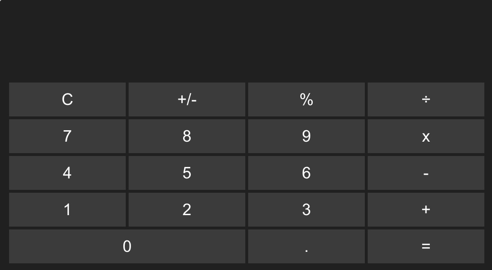

# React Calculator App

A simple calculator application built using React. This app performs basic arithmetic operations and demonstrates the use of React components and state management.

## Features

- **Basic Operations**: Supports addition, subtraction, multiplication, and division.
- **Modular Components**: Clean separation of components for ease of maintenance.

## Demo

<p align="center">
  
</p>

## Getting Started

### Installation

1. **Clone the repository**

   ```bash
   git clone https://github.com/mirzaim/react-calculator.git
   cd react-calculator
   ```

2. **Install dependencies**

   ```bash
   npm install
   ```

### Running the App

Start the development server:

```bash
npm start
```

Open [http://localhost:3000](http://localhost:3000) in your browser to view the app. The page will reload automatically if you make edits to the code.

### Building for Production

Create an optimized production build:

```bash
npm run build
```

The build artifacts will be stored in the `build/` directory.

